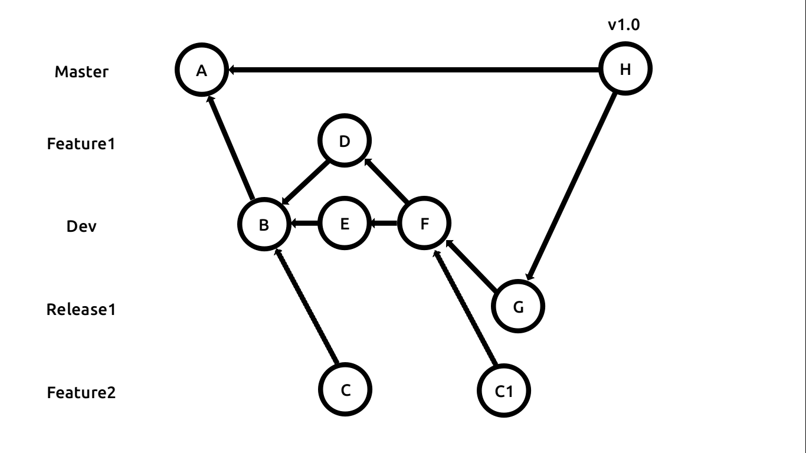

# Git

Here's a little warm up.

You will find the slides [here](https://docs.google.com/presentation/d/1tPQJ_aqAzjxRF3fahHcag87W768Hd3sO9zoOqq_7Q60/edit?usp=sharing)

Create​ ​ a ​ ​ Git​ ​ repository​ ​ with​ ​ the​ ​ commits​ ​ shown​ ​ in​ ​ the​ ​ commit​ ​ graph​ ​ and​ ​ table​ ​ below.​ ​ 
This simulates​ ​ a ​ ​ team​ ​ building​ ​ and​ ​ releasing​ ​ a ​ ​ product​ ​ using​ ​ the​ ​ Gitflow​ ​ workflow.

  

| Commit | File.txt content | Commit message  | Create on branch |Parents | 
| :----: | :----: |:----:|:----:|:----:|
| A | - | add ReadMe | Master | -
| B | "" | add File.txt | Dev | A
| C | "Feature2" | implement Feature 2 | Feature2 | B
| D | "Feature1" | implement Feature 1 | Feature1 | B
| E | "Minor update" | minor update | Dev | B
| F | "Feature 1 implemented" | merge Feature1 into Dev | Dev | E,D
| G | "Feature 1 implemented + Bug fixed" | feature 1 + bug fix | Release1 | F
| C1 | "Feature 2 + Feature 1" | feature 2 rebased | Feature2 | F
| H | "Feature 1" | Feature1 | Master | G